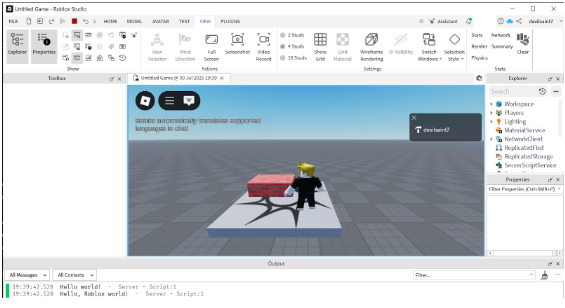

# 1. What is Luau?

**Luau** is Roblox’s lightweight, secure, and fast scripting language, derived from Lua.  
It controls interactivity, game logic, UI behavior, and more in Roblox experiences.  

- Luau scripts run on both the client and server side.  
- Learning it unlocks **90% of what makes Roblox games function**.

---

## Setting Up for Scripting

1. Open **Roblox Studio** and load a **Baseplate** template.  

2. Open the **Explorer** and **Properties** panels:  
   - `View > Explorer`  
   - `View > Properties`  

     

3. Right-click on **Workspace** → **Insert Object** → **Script**.  
   - This creates a **basic server script** inside the game world.  


---

## Your First Script

Replace the default text in the script with the following:

```lua
print("Hello, Roblox world!")
